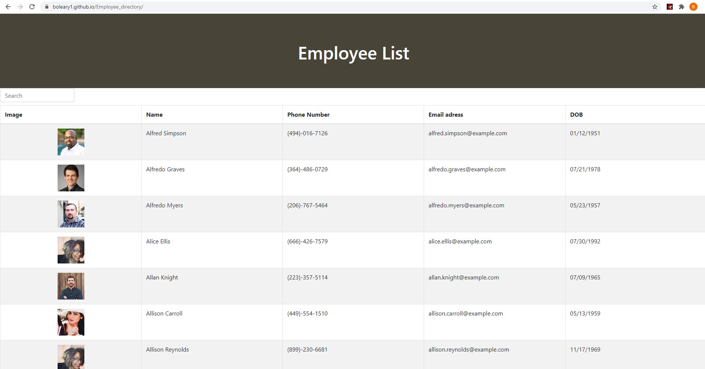

# Employee Directory
## Live website URL:
[live website](https://boleary1.github.io/Employee_directory/)
 
[GitHub Repository](https://github.com/boleary1/Employee_directory)
 

## **Description:**
Application built in Late October 2020.  Finds Employees and organazises them alphabetically in a table.  

Last edit was 11/1/2020 by Brian O'leary.  Contact oleary.brian1@gmail.com with any questions.

## **Screenshot:**

## license:
  MIT_License
  
  ## Contributing:
  Yes, clone the repository make your edits and then create a push request to be reviewed.  

  ## Testing:
  No.

